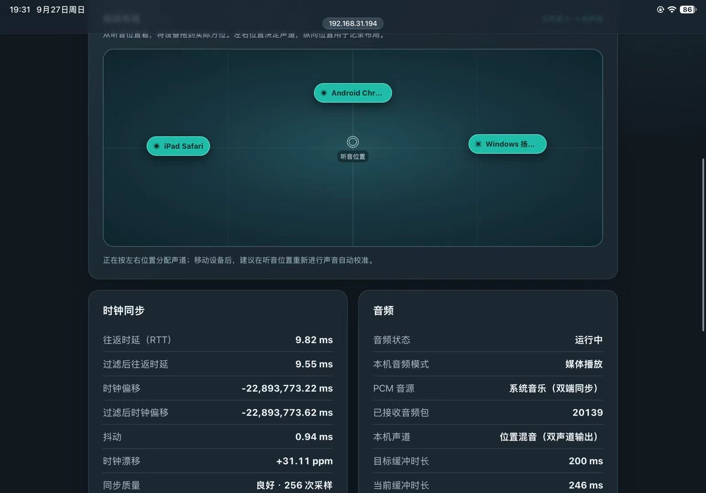

# Multi-device Audio Sync / 多设备音频同步

Synchronize Windows music with browser speakers on phones, tablets, and computers over a local network. The project includes a Windows master, a browser client for iPad Safari and Android Chrome, and acoustic delay calibration.

通过局域网让 Windows 正在播放的音乐与手机、平板和电脑浏览器同步。项目包含 Windows 主控、适用于 iPad Safari 和 Android Chrome 的浏览器扬声器，以及声学延迟校准。

> **Project status / 项目状态:** The Windows master and iPad Pro (2021) Safari music playback have been verified by the maintainer. Android Chrome is supported by the browser client but still needs physical-device verification. The spatial mode assigns stereo channels by physical speaker position; it is not an object-audio or Dolby Atmos renderer.
>
> Windows 主控与 iPad Pro（2021）Safari 音乐同步已由维护者实机验证。Android Chrome 可使用浏览器客户端，但仍需真机验证。空间模式按实体扬声器位置分配立体声声道，并非对象音频或杜比全景声渲染。

## Features / 功能

- Capture the Windows default playback mix with WASAPI loopback.
- Send timestamped 48 kHz stereo PCM to browser clients over WebSocket.
- Schedule Windows and browser playback against a shared clock, with adaptive network buffering.
- Calibrate each browser speaker acoustically using a physical Windows microphone.
- Use an optional virtual playback device to route computer music through the master while keeping a separate physical speaker output.
- Retain the original UDP synchronization code and experimental native Android/iOS clients.
- Switch between the original full-stereo sync mode and a room-layout spatial mode without changing the capture stream or acoustic calibration.

- 使用 WASAPI Loopback 捕获 Windows 默认播放混音。
- 通过 WebSocket 向浏览器客户端发送带时间戳的 48 kHz 立体声 PCM。
- 使用统一时钟排程 Windows 与浏览器播放，并根据网络状况调整缓冲。
- 使用 Windows 实体麦克风对各浏览器扬声器进行声学校准。
- 可选使用虚拟播放设备，将电脑音乐交给主控处理，再输出到独立的实体扬声器。
- 保留原有 UDP 同步代码，以及实验性的 Android/iOS 原生客户端。
- 可在原有完整立体声同步模式与房间布局空间模式之间切换，继续使用同一音源和声学校准。

## Playback modes / 播放模式

**Mode 1 — Normal sync:** Every active speaker plays the complete stereo stream. This is the original behavior and remains the default on first launch.

**Mode 2 — Spatial audio:** Open the browser speaker page and choose **Spatial audio**. Drag the Windows speaker and each connected browser speaker on the room map to match their positions relative to the listening point. The leftmost active speaker mainly plays the left channel; the rightmost mainly plays the right channel. Speakers between them receive a weighted mix. The vertical position is recorded for the room diagram but does not yet change audio. Fewer than two active speakers, or speakers with nearly identical horizontal positions, keep full stereo. Mode and positions are saved locally by the Windows master. After moving a physical speaker or changing the listening point, run acoustic calibration again.

**版本 1——普通同步：**各扬声器仍播放完整立体声。这是原来的播放方式，首次启动默认使用它。

**版本 2——空间音频：**在浏览器扬声器页面选择“空间音频”，按实际方位拖动房间图中的 Windows 扬声器和已连接设备。最左侧设备主要播放左声道，最右侧主要播放右声道，中间设备按位置混合。纵向位置目前只记录布局，不改变声音。少于两台有效扬声器，或设备左右位置过近时，仍播放完整立体声。模式与位置由 Windows 主控保存在本地。移动实体设备或改变听音位置后，请重新进行声音自动校准。

### 界面预览 / Interface preview

空间音频房间布局与播放状态（iPad 页面实机截图）。Spatial room layout and playback status on an iPad.



## 安装与使用（Windows + iPad）

### 1. 下载和安装

1. 使用 Windows 10/11 x64。在 [v0.2.0 发布页](https://github.com/looooooopyzy/multi-device-audio-sync/releases/tag/v0.2.0) 下载 **`multi-device-audio-windows-x64-v0.2.0.zip`**，解压到普通文件夹。保持 `windows-calibrator.exe`、`windows-master.exe`、`web-client/` 和 `tools/` 的相对位置；只下载单个 EXE 无法独立运行。Release 用户**不需要** CMake 或编译器。
2. 安装 Python 3.10 或更新版本，安装时将 Python 加入 `PATH`。在解压目录打开一次 PowerShell，运行 `python -m pip install -r tools/requirements.txt`。图形程序需要能找到 `pythonw.exe`，之后正常启动无需打开终端。若程序提示找不到 `pythonw.exe`，检查 Python 安装和 `PATH`，然后重新打开程序。
3. 若要让**电脑实体扬声器与 iPad 同步播放电脑音乐**，安装 [VB-CABLE](https://vb-audio.com/Cable/) 或兼容的虚拟播放设备。Windows“声音输出”将 **CABLE Input (VB-Audio Virtual Cable)** 设为默认设备；这是给主控捕获音乐用的虚拟输出，本身不会发声。实体扬声器要在本程序的“电脑扬声器输出”中选。如果某个音乐软件被单独指定了输出设备，也要把它的输出改到 CABLE Input，并重新打开音乐软件。

### 2. 启动 Windows 主控

1. 双击解压目录中的 **`windows-calibrator.exe`**，音源选择“电脑正在播放的音乐”，在“电脑扬声器输出”选择真实扬声器或耳机。首次弹出 Windows 防火墙提示时，允许其在可信的**专用网络**通信。Windows 与 iPad 需要在可互访的同一局域网；访客 Wi-Fi 或 AP 隔离会阻止连接。
2. 等窗口底部出现“**双端受控播放已就绪**”。如果显示“仅 iPad 转发”，说明当前没有启用电脑实体扬声器的同步转送；检查 Windows 默认输出是否为 CABLE Input，检查本程序选择的是否为真实扬声器，再点“重新启动服务”。更改 Windows 默认输出后程序也会自动重新匹配并重连，等它再次显示就绪。
3. 启动播放器播放一首歌曲。声音应由本程序选中的电脑实体扬声器发出；不要把 CABLE Input 当作听歌扬声器。

### 3. iPad 首次连接与证书

1. iPad 与电脑连上同一局域网。在 iPad Safari 打开 Windows 程序显示的“**iPad 首次设置地址**”（`http://.../setup.html?...`）。地址中的 IP 和端口以**当前窗口实际显示**为准。
2. 点“下载 Windows 主控证书”，到 iPad“设置”安装已下载的描述文件；随后打开“**设置 → 通用 → 关于本机 → 证书信任设置**”，给 **Multi-device Audio LAN CA** 启用完全信任。只安装你自己电脑生成的证书。
3. 回到设置网页，点“打开 HTTPS 自动校准”，或复制 Windows 窗口的 `https://.../` 地址。Safari 中点击“启用扬声器”，保持网页在前台。看到“系统音乐（双端同步）”且“已接收音频包”持续增加后，iPad 应开始播放电脑音乐。音乐同步模式使用 Windows 实体麦克风校准，**不会把 iPad 切到通话音频**；无须为此开启 iPad 麦克风。首次设置不需要 Mac。

### 4. 校准与选择模式

1. 暂停音乐，把 Windows **真实麦克风**放在通常听音位置附近，让它能录到电脑扬声器与 iPad 的两次短校准声。在 iPad 页面等待时钟样本充足，点击“**双向声音自动校准**”。若失败，检查 Windows 录音设备不是 VB-CABLE 虚拟输入、环境尽量安静，再重试。完成后恢复音乐播放。
2. 在网页“播放方式”选择“**普通同步**”或“**空间音频**”。普通同步保持以前的完整立体声。空间音频打开房间图：从听音位置看，拖动 Windows 与 iPad 节点到实际左右方位。至少两台已启用的扬声器要有明显左右间距，声道分配才会生效。房间图的纵向位置目前只用于记录布局。
3. 模式切换不需要重启服务。移动实体设备或改变听音位置后，重新做一次声音自动校准。模式和布局保存在 Windows 主控本地。

Android Chrome 可使用同一个浏览器客户端播放，但声学同步仍待 Android 真机验证；其音乐播放可直接打开主控 HTTP 地址。播放与校准时让移动浏览器保持前台。

### 常见问题

| 现象 | 检查 |
| --- | --- |
| iPad 有声，电脑没声 | Windows 默认输出设为 CABLE Input；程序里的“电脑扬声器输出”选实体设备；等待“**双端受控播放已就绪**”。 |
| 两端都没音乐 | 确认音乐软件确实输出到 CABLE Input；检查程序音源是“电脑正在播放的音乐”，并重新打开音乐软件。 |
| iPad 无法打开网页 | 使用程序当前显示的 IP/端口，确认同一局域网、没有访客网络隔离，并检查 Windows 专用网络防火墙。HTTPS 首次使用还要完成证书安装与完全信任。 |
| iPad 页面已连接但无声 | 点“启用扬声器”，保持 Safari 在前台，观察已接收音频包是否增加。 |
| 自动校准失败 | 暂停音乐，确认 Windows 使用能听见两台设备的实体麦克风；调整麦克风位置后重试。 |
| 空间模式听不出左右变化 | 确认至少两台扬声器已启用、房间图的左右位置不同，并用具有明显左右声道内容的立体声歌曲试听。 |

## Installation and use (English)

1. On Windows 10/11 x64, download the **complete ZIP** from the [v0.2.0 release](https://github.com/looooooopyzy/multi-device-audio-sync/releases/tag/v0.2.0) and extract it. Keep both EXEs alongside `web-client/` and `tools/`. Release users do not need CMake or a compiler. Install Python 3.10+ with `pythonw.exe` on `PATH`; once, from the extracted folder, run `python -m pip install -r tools/requirements.txt`.
2. For synchronized PC and iPad music, install [VB-CABLE](https://vb-audio.com/Cable/) or a compatible virtual output. Make **CABLE Input** the Windows default playback device. In `windows-calibrator.exe`, select a **physical** speaker under “电脑扬声器输出” and choose the computer-music source. If a music app has its own output setting, route it to CABLE Input and reopen it. Allow the app through the Windows firewall on your trusted private network, then wait for **“双端受控播放已就绪”** (synchronized playback ready).
3. On an iPad on the same reachable LAN, open the **first-time setup HTTP URL** shown by the Windows app. Download and install its certificate profile; then enable full trust under **Settings → General → About → Certificate Trust Settings**. Open the HTTPS URL shown in the app. In Safari, tap **“启用扬声器”** (Enable Speaker) and keep the page foregrounded. The received PCM packet count should rise while music plays. No Mac is needed.
4. Pause music and place a **physical Windows microphone** where you normally listen. On the iPad page, tap **“双向声音自动校准”** (Two-way acoustic calibration). In computer-music mode the iPad microphone stays off to preserve media playback. Resume music after calibration.
5. Choose **“普通同步”** (Normal sync) to keep full stereo on every speaker, or **“空间音频”** (Spatial audio) to drag active devices on the room map and assign channels by left/right position. At least two active speakers must have distinct horizontal positions. Recalibrate after moving a speaker or the listening position. The Windows master saves the selected mode and layout locally.

If PC sound is missing, verify that Windows defaults to CABLE Input, the GUI selects a real speaker, and its status says synchronized playback ready. If the iPad cannot connect, verify the current IP/port, local-network reachability, firewall, and certificate trust. Keep mobile browsers in the foreground. Android Chrome uses the same browser client, but acoustic alignment still needs Android device verification.

## 从源码构建 / Build from source

仅从源码运行时需要 CMake 3.20+、Ninja 和 C++17 Windows 编译器（MinGW-w64 或 Visual C++）。Release 压缩包已经包含构建好的程序。

Building from source requires CMake 3.20+, Ninja, and a C++17 Windows toolchain (MinGW-w64 or Visual C++). The release ZIP already contains the built executables.

```powershell
python -m pip install -r tools/requirements.txt
cmake -S . -B build -G Ninja -DCMAKE_BUILD_TYPE=Release
cmake --build build
```

构建后运行 `build\windows-master\windows-calibrator.exe`。After building, run `build\windows-master\windows-calibrator.exe`.

## Command-line mode / 命令行模式

Run a browser test tone:

```powershell
.\build\windows-master\windows-master.exe --source tone --web-only
```

Capture the Windows default playback mix and forward it to browser clients:

```powershell
.\build\windows-master\windows-master.exe --source system --web-only
```

For synchronized local and browser playback, use a virtual endpoint as the Windows default output and specify a different physical render device:

```powershell
.\build\windows-master\windows-master.exe --source system --local-stream-output --render-device 1 --web-only
```

Run the existing C++ and Python integration tests with:

```powershell
ctest --test-dir build --output-on-failure
```

播放浏览器测试音：

```powershell
.\build\windows-master\windows-master.exe --source tone --web-only
```

捕获 Windows 默认播放混音并转发到浏览器：

```powershell
.\build\windows-master\windows-master.exe --source system --web-only
```

要让电脑实体扬声器和浏览器同步播放，请将虚拟设备设为 Windows 默认输出，并指定另一个实体渲染设备：

```powershell
.\build\windows-master\windows-master.exe --source system --local-stream-output --render-device 1 --web-only
```

运行现有 C++ 和 Python 集成测试：

```powershell
ctest --test-dir build --output-on-failure
```

The command-line master prints its local-network URL. Allow the chosen TCP port through Windows Firewall on a trusted private network. The GUI selects free HTTP and HTTPS ports automatically. Do not expose these services to the public internet.

命令行主控会打印局域网访问地址。请在可信的专用网络中允许 Windows 防火墙放行所选 TCP 端口。图形程序会自动选择空闲 HTTP 和 HTTPS 端口。请勿将这些服务暴露到公网。

## Architecture / 架构

- `windows-master/`: Windows GUI launcher, WASAPI loopback capture, physical-device playback, calibration, and HTTP/WebSocket master.
- `web-client/`: browser speaker interface using Web Audio scheduling and PCM jitter buffering.
- `shared/`: clock synchronization, UDP protocol, PCM packet format, and acoustic-probe analysis.
- `android-client/`, `ios-client/`, `ios-playground/`: retained native experiments; the native Android client does not currently play the synchronized music stream.
- `tests/`: protocol, web, HTTPS, and audio-stream integration checks.
- `docs/`: architecture, calibration, protocol, and setup notes.

- `windows-master/`：Windows 图形启动器、WASAPI Loopback 捕获、实体设备播放、校准，以及 HTTP/WebSocket 主控。
- `web-client/`：使用 Web Audio 排程和 PCM 抖动缓冲的浏览器扬声器界面。
- `shared/`：时钟同步、UDP 协议、PCM 数据包格式和声学校准信号分析。
- `android-client/`、`ios-client/`、`ios-playground/`：保留的原生客户端实验；当前 Android 原生客户端尚不能播放同步音乐流。
- `tests/`：协议、网页、HTTPS 和音频流集成检查。
- `docs/`：架构、校准、协议和配置说明。

## Limitations / 当前限制

- Audio is stereo PCM. The spatial mode is position-based channel distribution around one listening point; multichannel object rendering and per-application capture are not implemented.
- System capture records the Windows default playback endpoint mix.
- Browser pages must remain foregrounded for reliable mobile playback.
- Android Chrome playback is implemented in the shared browser client, but Android acoustic synchronization still needs physical-device verification.
- Native iOS development and Codemagic IPA signing are paused.

- 当前传输为立体声 PCM；空间模式围绕一个听音位置分配声道，尚未实现多声道对象音频渲染或按应用捕获。
- 系统捕获读取 Windows 默认播放端点的混音。
- 为保证移动端稳定播放，浏览器页面需要保持在前台。
- Android Chrome 可使用通用浏览器客户端，但 Android 真机声学同步仍需验证。
- 原生 iOS 开发与 Codemagic IPA 签名目前暂停维护。

## License / 许可证

This project is released under the MIT License. See [LICENSE](LICENSE).

本项目采用 MIT 许可证，详见 [LICENSE](LICENSE)。
